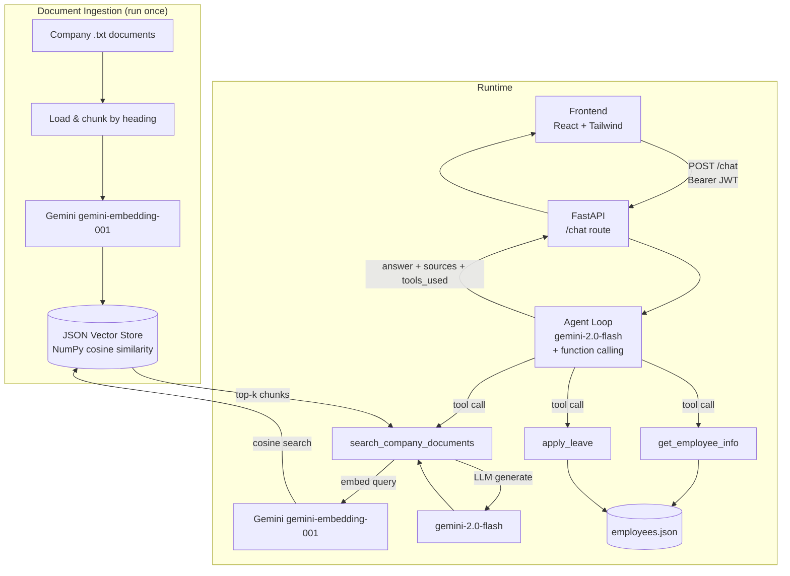

# Employee AI Assistant

An AI-powered chat assistant that helps employees get answers to company policy questions, check their leave balance, and apply for leave — all in one place.

Built for the **EndWidth Full Stack + Generative AI Assessment**.

---

## What Does It Do?

You open a chat window, type a question, and the assistant figures out the best way to answer it:

- **Ask about company policies** → It searches the company documents and gives you an accurate answer with the source file name.
- **Ask about your leave balance** → It looks up your employee profile.
- **Apply for leave** → It checks your balance first, then submits the request.
- **Ask follow-up questions** → It remembers the conversation so you don't have to repeat yourself.

If the information isn't in the company documents, it will say so honestly — it won't make something up.

---

## How It Works (Simple Version)

```
You type a question
        ↓
  AI Agent decides what to do
        ↓
  ┌──────────────────────────────────────┐
  │  Option A: Search company documents  │  ← for policy questions
  │  Option B: Look up your info         │  ← for leave balance
  │  Option C: Apply for leave           │  ← for leave requests
  └──────────────────────────────────────┘
        ↓
  LLM writes a clear answer
        ↓
  You see the answer + sources used
```

---

## Architecture

**High-level diagram:**

```
                    Company Documents (.txt)
                            │
                      Load & Split into Chunks
                            │
                    Generate Embeddings (Gemini)
                            │
                     JSON Vector Store (NumPy)
                            │
    ┌───────────────────────────────────────────────────────┐
    │                   FastAPI Backend                     │
    │                                                       │
    │  User → POST /chat → JWT Auth → Agent Loop            │
    │                          │                           │
    │          ┌───────────────┼───────────────┐           │
    │          ↓               ↓               ↓           │
    │  search_documents  get_employee_info  apply_leave    │
    │          │               │               │           │
    │     Vector Store    employees.json   employees.json  │
    │          │                                           │
    │        Gemini LLM → Final Answer                     │
    └───────────────────────────────────────────────────────┘
                            │
                    React Frontend (Vite)
                    Chat UI + Sources + Tools
```

**Detailed Mermaid diagram:**



See [`docs/architecture.md`](docs/architecture.md) for more detail.

---

## Technologies Used

| Layer | Technology |
|---|---|
| Frontend | React, Vite, Tailwind CSS |
| Backend | Python, FastAPI |
| AI / LLM | Google Gemini (`gemini-2.0-flash`) |
| Embeddings | Google Gemini (`gemini-embedding-001`) |
| Vector Store | Custom JSON file + NumPy (no external DB needed) |
| Auth | JWT (JSON Web Tokens) |
| Deployment | Docker + Docker Compose |
| Testing | pytest (51 tests) |

---

## Chunking Strategy

Company documents are too long to search all at once, so they're split into smaller pieces called **chunks** before being stored. Here's how:

1. **Split on headings** — Every `## Heading` in a document creates a new chunk. This keeps related content together (e.g., one chunk for "Annual Leave", another for "Sick Leave").
2. **Split long sections** — If a chunk is still over ~1600 characters (~400 tokens), it gets further split with a **200-character overlap** between pieces. The overlap ensures answers don't get cut off at a boundary.
3. **ID by content hash** — Each chunk gets an MD5 hash ID so re-running ingestion safely updates chunks without creating duplicates.

**Example:** `leave_policy.txt` with 3 headings → 3 chunks, each embedded separately and stored in the vector store.

---

## Embedding Model

**Model used:** `models/gemini-embedding-001`

- Each chunk is converted into a list of numbers (a "vector") that captures its meaning.
- When you ask a question, your question is also converted into a vector.
- The system then finds which chunks have vectors closest to your question's vector — those are the most relevant.
- Task type `retrieval_document` is used for chunks; `retrieval_query` is used for questions.

---

## Vector Database

**Choice:** Custom JSON file (`backend/vector_store_data/store.json`) + NumPy

**Why not ChromaDB / Pinecone / FAISS?**
For this assessment scope, a self-contained pure-Python solution avoids external infrastructure while demonstrating the core concepts clearly. The store supports upsert-by-ID, cosine similarity search, and is easy to inspect as plain JSON.

**Retrieval approach (step by step):**
1. Embed the user's question into a vector.
2. Compute cosine similarity between the question vector and all stored chunk vectors.
3. Return the top-4 most similar chunks.
4. **Rerank** with a hybrid score: `final_score = 0.7 × vector_similarity + 0.3 × keyword_overlap`. This ensures exact terms like "maternity" or "probation" score highly even if semantic similarity alone is ambiguous.
5. Filter by a confidence threshold (`0.35`) — if nothing scores high enough, return a "not found" message instead of guessing.

---

## Agent & Tool Implementation

The agent uses **Gemini's function-calling feature** in a loop:

1. The user's message + full conversation history is sent to `gemini-2.0-flash` along with descriptions of the 3 available tools.
2. Gemini decides which tool(s) to call (or answers directly if no tool is needed).
3. The backend runs the chosen tool(s) and feeds the results back to Gemini.
4. This loop repeats up to **5 times** until Gemini produces a final text answer.

**The 3 tools:**

| Tool | What it does |
|---|---|
| `search_company_documents(query)` | Embeds the query, searches the vector store, returns an LLM-generated answer with source citations |
| `get_employee_info(employee_id)` | Looks up the mock employee DB and returns name, department, role, and leave balance |
| `apply_leave(employee_id, start_date, end_date, reason)` | Validates dates and balance, deducts leave days, returns a confirmation message |

**Security note:** When `apply_leave` is called, the `employee_id` is always taken from the authenticated JWT token — not from the user's message. You cannot apply leave on behalf of someone else.

---

## Quick Start

### Option 1: Docker (Easiest)

```bash
# 1. Clone the repo
git clone <repo-url>
cd EndWidth-Assessment

# 2. Add your Gemini API key
cp .env.example .env
# Open .env and set: GEMINI_API_KEY=your_key_here

# 3. Run everything
docker compose up --build
```

- Frontend: http://localhost:5173
- Backend API docs: http://localhost:8000/docs

---

### Option 2: Run Locally

**Requirements:** Python 3.11+, Node.js 18+, a [Gemini API key](https://aistudio.google.com/app/apikey)

**Step 1 — Backend:**
```bash
# Create virtual environment
python -m venv .venv
.venv\Scripts\activate        # Windows
# source .venv/bin/activate   # macOS/Linux

# Install dependencies
pip install -r requirements.txt

# Set up environment variables
cp .env.example .env
# Edit .env → set GEMINI_API_KEY=your_key_here

# Build the vector store (run this once before starting the server)
cd backend
python -m ingestion.ingest

# Start the backend server
uvicorn main:app --reload --port 8000
```

**Step 2 — Frontend:**
```bash
cd frontend
npm install
npm run dev
```

Open http://localhost:5173 in your browser.

---

## Demo Accounts

Use these to log in (no setup needed — they're built in):

| Employee ID | Name | Department | Password |
|---|---|---|---|
| `EMP001` | Rahul Sharma | Engineering | `Rahul@123` |
| `EMP002` | Priya Nair | HR | `Priya@123` |
| `EMP003` | Arjun Mehta | Finance | `Arjun@123` |

---

## Sample Questions to Try

```
1. What is the work from home policy?
   → Searches company documents, returns policy + source file

2. How many annual leaves are allowed?
   → Searches company documents

3. Does the company provide pet insurance?
   → Returns "not found" — no hallucination

4. How many leaves do I have remaining?
   → Looks up your employee record

5. What is the leave policy and how many leaves do I have?
   → Uses both: document search + employee lookup

6. Apply leave for me from 2026-09-20 to 2026-09-22 because I'm travelling.
   → Checks balance, then submits leave

7. (After question 6) How many leaves will I have left?
   → Uses conversation memory — no need to repeat context
```

See [`docs/sample_queries.md`](docs/sample_queries.md) for 10 detailed examples with expected responses.

---

## Running Tests

All tests run without a real API key (Gemini calls are mocked):

```bash
pytest backend/tests/ -v
```

| Test File | What It Tests | Tests |
|---|---|---|
| `test_auth.py` | Password hashing, JWT signing, token expiry | 7 |
| `test_tools.py` | Employee lookup, leave validation, edge cases | 13 |
| `test_retriever.py` | Reranking, confidence threshold, hallucination fallback | 12 |
| `test_routes.py` | All API endpoints, auth, streaming | 19 |
| **Total** | | **51** |

---

## Assumptions

These are decisions made during development that may differ from a production system:

- **Documents are plain `.txt` files** — PDFs are not parsed. Conversion to `.txt` is assumed to happen before ingestion.
- **Employee data is in-memory** — The `employees.json` file is loaded at startup. Leave balance changes are lost when the server restarts (no persistent database).
- **Dates must be `YYYY-MM-DD`** — The LLM converts natural-language dates (e.g., "20 September") to this format before calling the leave tool.
- **One employee per session** — Each user logs in with their own account. The agent always acts on behalf of the authenticated user.
- **Vector store must be pre-built** — Run `python -m ingestion.ingest` once from the `backend/` directory before starting the server.
- **All employees share the same company documents** — No per-department document filtering.

---

## Limitations

Known limitations of this implementation:

- **Leave state resets on restart** — Any leave applied during a session is lost when the server stops. A real system would use a database.
- **No PDF/DOCX support** — Only `.txt` files are ingested.
- **No persistent chat history** — Conversation history lives in server memory and is lost on restart.
- **Single-server only** — In-memory state (sessions, leave balance) won't work across multiple server instances.
- **Gemini API rate limits** — Heavy usage may hit Google's API limits. The agent retries once after 25 seconds on a 429 error.
- **No metadata filtering** — Retrieval searches all documents equally with no category filter.
- **Confidence threshold is manually tuned** — The `0.35` threshold was set for the provided documents. Different document sets may need adjustment.

---

## API Reference

See [`docs/api.md`](docs/api.md) for full endpoint specs, curl examples, and SSE event formats.

**Quick reference:**

| Endpoint | Method | Auth | Description |
|---|---|---|---|
| `/health` | GET | No | Health check |
| `/auth/login` | POST | No | Get JWT token |
| `/auth/me` | GET | JWT | Get your profile |
| `/chat` | POST | JWT | Send a message |
| `/chat/stream` | POST | JWT | Streaming chat (SSE) |
| `/session/{id}` | DELETE | JWT | Clear chat history |
