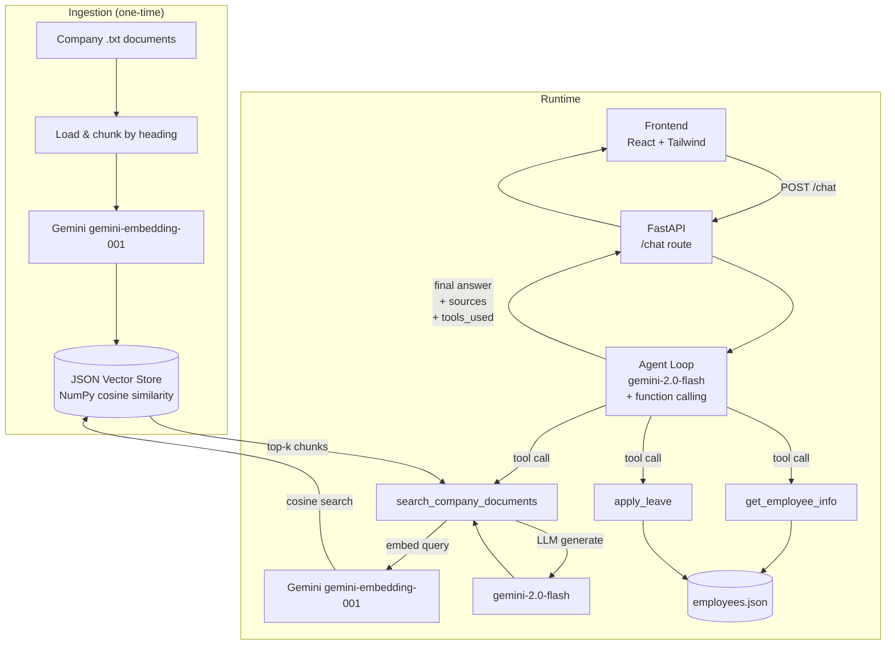

# Architecture

## System Diagram

## Data Flow Summary

1. **Ingestion** (run once before starting the server):
   - Each `.txt` file is split on `##` headings → further split if > ~1600 chars
   - Every chunk is embedded with Gemini `gemini-embedding-001` and stored in `vector_store_data/store.json` with its source filename

2. **Chat request** arrives at `POST /chat` with `employee_id`, `message`, `session_id`

3. **Agent loop** sends the message + conversation history + tool descriptions to `gemini-2.0-flash`

4. **Gemini** either responds directly or requests a tool call:
   - `search_company_documents` → embed query → NumPy cosine search → LLM synthesises answer
   - `get_employee_info` → lookup `employees.json`
   - `apply_leave` → validate dates & balance → deduct → return confirmation

5. Tool results feed back into the conversation; loop repeats (max 5 iterations)

6. Final text answer, source list, and tool list are returned to the frontend

