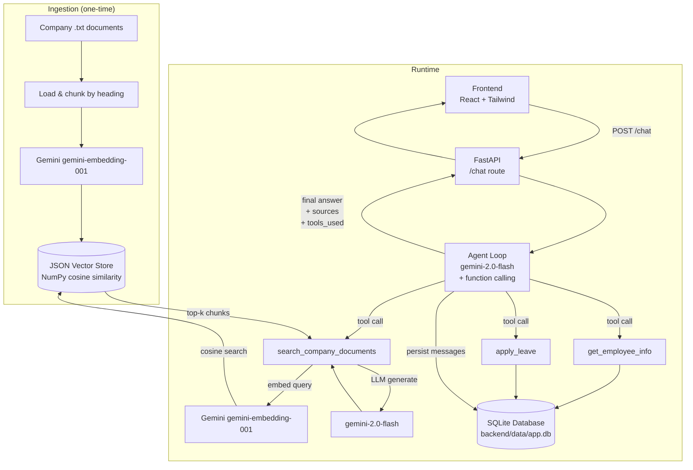

# Architecture

## System Diagram

```mermaid
flowchart TD
    subgraph Ingestion ["Ingestion (one-time)"]
        D[Company .txt documents] --> L[Load & chunk by heading]
        L --> E[Gemini gemini-embedding-001]
        E --> V[(JSON Vector Store\nNumPy cosine similarity)]
    end

    subgraph Runtime ["Runtime"]
        FE[Frontend\nReact + Tailwind] -->|POST /chat| API[FastAPI\n/chat route]
        API --> AG[Agent Loop\ngemini-2.0-flash\n+ function calling]

        AG -->|tool call| T1[search_company_documents]
        AG -->|tool call| T2[get_employee_info]
        AG -->|tool call| T3[apply_leave]

        T1 -->|embed query| E2[Gemini gemini-embedding-001]
        E2 -->|cosine search| V
        V -->|top-k chunks| T1
        T1 -->|LLM generate| LLM[gemini-2.0-flash]
        LLM --> T1

        T2 --> SDB[(SQLite Database\nbackend/data/app.db)]
        T3 --> SDB
        AG -->|persist messages| SDB

        AG -->|final answer\n+ sources\n+ tools_used| API
        API --> FE
    end
```

## Data Flow Summary

1. **Ingestion** (run once before starting the server):
   - Each `.txt` file is split on `##` headings → further split if > ~1600 chars
   - Every chunk is embedded with Gemini `gemini-embedding-001` and stored in `vector_store_data/store.json` with its source filename

2. **Chat request** arrives at `POST /chat` with `employee_id`, `message`, `session_id`

3. **Agent loop** sends the message + conversation history + tool descriptions to `gemini-2.0-flash`

4. **Gemini** either responds directly or requests a tool call:
   - `search_company_documents` → embed query → NumPy cosine search → LLM synthesises answer
   - `get_employee_info` → lookup employee record in SQLite Database (`app.db`)
   - `apply_leave` → validate dates & balance against SQLite DB → deduct balance & record application in `leave_applications` table → return confirmation

5. **State Persistence**: All conversation history messages and leave requests are atomically saved to SQLite DB (`app.db`), surviving server and container restarts.

6. Tool results feed back into the conversation; loop repeats (max 5 iterations)

7. Final text answer, source list, and tool list are returned to the frontend

